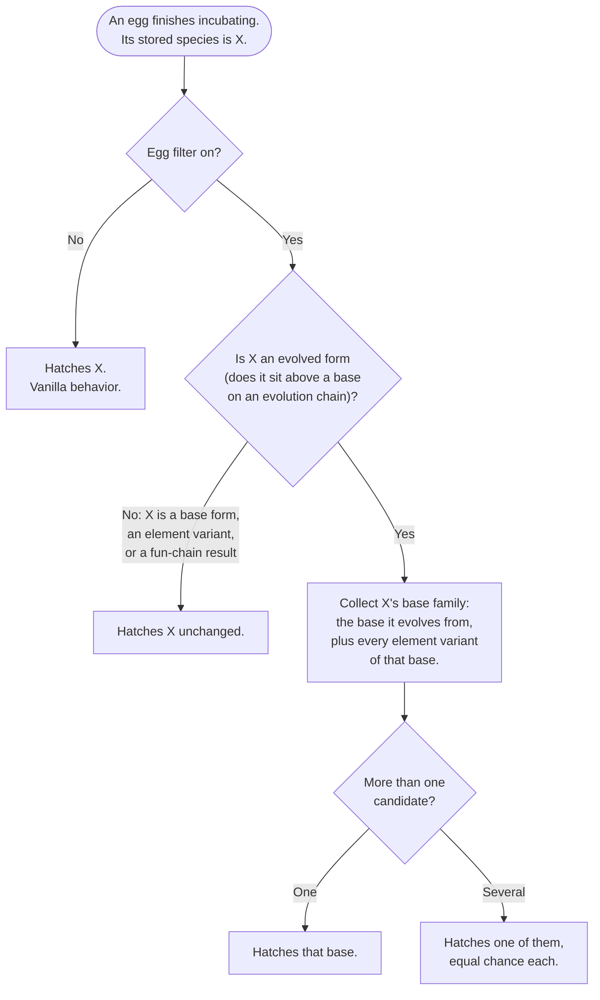
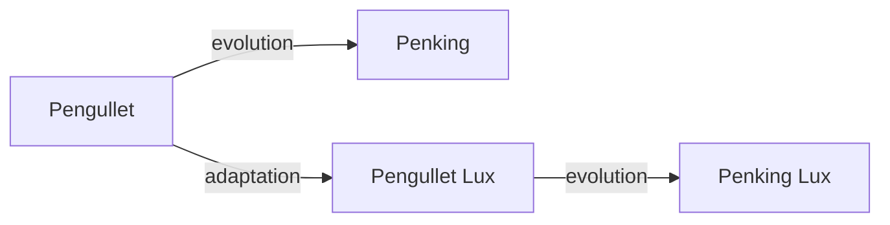

# The Egg Filter

> 🛟 **Need help or found a bug?** Get support at [support.doodesch.de](https://support.doodesch.de).

Palvolve lets you evolve a captured Pal into a related form. The egg filter is the breeding side of that: with it on, eggs only ever hatch **base forms**, so an evolved Pal stays something you earned at the workbench instead of something that falls out of an egg. It changes nothing about how eggs are made, only what comes out of them.

The filter is **off by default** (opt-in). Turn it on and eggs of evolved forms hatch their base species; leave it off and breeding behaves exactly like vanilla Palworld. This guide explains what it does when it is on, so you can decide whether you want it.

## Turning it on and off

Two ways, they do the same thing:

- **Web configurator** - open [palvolve.doodesch.de](https://palvolve.doodesch.de), enable the egg filter in the settings, and export your `config_user.lua` into `%LocalAppData%\Pal\Saved\Palvolve\`.
- **By hand** - in `scripts\config.lua`, set `eggFilter = { enabled = true }`.

On a co-op or dedicated setup the host or server owns the decision, so the filter setting there is the one that counts.

## What an egg hatches

Every pair Palvolve knows is one of three kinds, and the filter treats them differently:

- **Evolution** (Pengullet to Penking) - a Pal becoming a different Pal. This is the only kind the filter walks backwards.
- **Adaptation** (Pengullet to Pengullet Lux) - a Pal changing its element. Never gated. An egg of a pure element variant hatches unchanged.
- **Fun chain** (Cattiva to Nyafia) - a deliberate joke transformation. Never walked. A fun-chain result hatches unchanged, so a Nyafia egg stays a Nyafia egg.

So when an egg finishes incubating, the decision looks like this:

The base family is the part that decides the outcome, so here is a real one.

## A worked example: the Pengullet family

Three of the pairs Palvolve ships for the Pengullet family:

Pengullet has an evolved form (Penking) and an element variant (Pengullet Lux), and that variant has its own evolved form (Penking Lux). The base family here is therefore **both base-tier Pals**: Pengullet and Pengullet Lux. When the filter normalizes an egg down to this family, it picks one of them at random, each with an equal chance.

Run every egg in the family through the filter and you get:

| Egg of | Filter off | Filter on |
|---|---|---|
| Pengullet | Pengullet | Pengullet - it is already a base |
| Pengullet Lux | Pengullet Lux | Pengullet Lux - element variants are never gated |
| Penking | Penking | Pengullet **or** Pengullet Lux, equal chance |
| Penking Lux | Penking Lux | Pengullet **or** Pengullet Lux, equal chance |

The two evolved forms (Penking, Penking Lux) collapse to the same base family, because both descend from it. The two base-tier forms hatch unchanged, one because it is the base, the other because it is a pure element adaptation.

## The rules in one place

- **Base form** - hatches unchanged.
- **Element variant** (pure adaptation, nothing evolves into it) - hatches unchanged.
- **Evolved form** - hatches its base family: the base it came from, plus any element variants of that base. If the family has several members, one is chosen at random with an equal chance.
- **Fun-chain result** - hatches unchanged. Fun chains are never walked back.

Two things follow from this:

- The filter reads **your** tree. If you rewire pairs in the configurator, mark a link as an adaptation instead of an evolution, or disable a pair, the egg filter follows those exact pairs. The Pengullet outcome above is only what the shipped tree produces.
- The choice is made while the egg hatches, not when it is laid, so the current setting applies to eggs that are already incubating.

## What it does not touch

- **Which eggs you get:** breeding combinations and egg drops are unchanged. The filter only rewrites the species an egg hatches into, and only for evolved forms.
- **Stats and identity:** a normalized hatch is a normal newborn of the base species. Nothing is copied over from the evolved form, because it was never born as one.
- **Pals you already own:** only eggs are affected. An evolved Pal in your team or Palbox stays exactly as it is.
